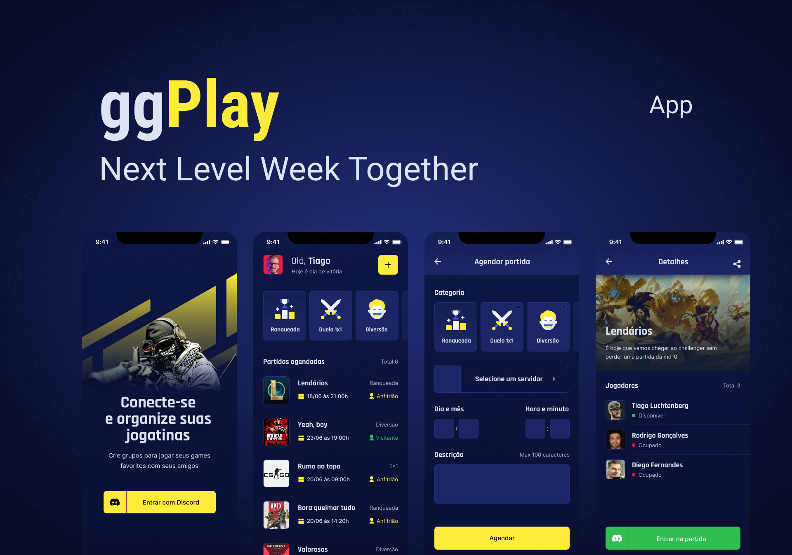

<p align="center">
  
</p>

<p align="center">
  
  
  

  
</p>

<h1 align="center">
    
</h1>

<br>

<h1 align="center">

  
</h1>

<br>

## 🧪 Technologies

This project was developed using the following technologies:

- [React Native](https://reactnative.dev/)
- [Expo](https://expo.io/)

## 🚀 Getting started

Clone the project and access the folder.

```bash
$ git clone https://github.com/lucasfontesgaspareto/nlw-together-react-native.git
$ cd nlw-together-react-native
```

Follow the steps below:

```bash
# Install the dependencies
$ npm install

# Start the project
$ npm start
```

## 🔖 Layout

You can view the project layout through the links below:

- [Layout](<https://www.figma.com/file/QuGsKlxxUgoNccIf78dNWo/GamePlay---NLW-Together-(ggPlay)?node-id=58924%3A898/duplicate>)

Remembering that you need to have a [Figma](http://figma.com/) account to access it.

## 📝 License

This project is licensed under the MIT License. See the [LICENSE](LICENSE.md) file for details.

---

Made with 💜 by [lucasfontesgaspareto](https://github.com/lucasfontesgaspareto)
<br>
README.md inspired by [birobirobiro](https://www.birobirobiro.dev)
<br>
👋
